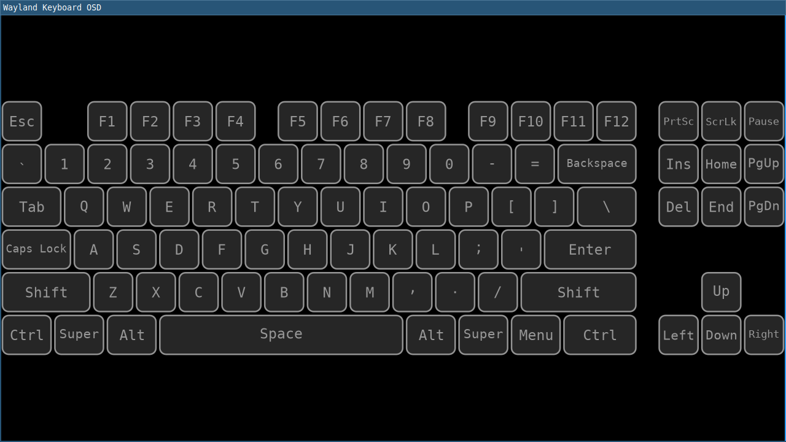

# wayland-kbd-osd

Partly scratching an itch, partly an experiment in vibe coding. Written (almost) entirely by Google Jules.

## Features

* Displays keyboard input visually on screen.
* Configurable key layout and appearance via TOML file (`keys.toml`).
* Supports overlay mode on Wayland compositors (via `wlr-layer-shell`).
* Can fall back to a normal window if overlay mode is not available or not requested.

## Requirements

* Rust and Cargo
* Wayland compositor
* `libinput` and its development headers (e.g., `libinput-dev` or `libinput-devel` on most systems)
* `freetype2` development headers (e.g., `libfreetype6-dev` or `freetype-devel`)
* `pkg-config`
* For overlay mode: A Wayland compositor that supports the `wlr-layer-shell-unstable-v1` protocol.

## Building

```bash
cargo build --release
```
The executable will be located at `target/release/wayland_kbd_osd`.

## Running

```bash
./target/release/wayland_kbd_osd
```

To run in overlay mode (recommended for typical use):
```bash
./target/release/wayland_kbd_osd --overlay
```

See `./target/release/wayland_kbd_osd --help` for more options.

## Configuration

The application is configured using a TOML file, by default `keys.toml` in the current working directory.
You can specify a different configuration file using the `--config` option.

An example `keys.toml` is provided, showcasing a standard keyboard layout and some overlay settings.

### Key Input Permissions

For the application to detect keyboard input, it needs permission to read from input devices (typically `/dev/input/event*`). On most Linux systems, this is managed by adding your user to the `input` group:

```bash
sudo usermod -aG input $USER
```

**You will need to log out and log back in for this change to take effect.**

If you see errors in the log like "Failed to open path /dev/input/event..." or if key presses are not being displayed, this is the most common cause. The application will still attempt to run visually even if input devices cannot be accessed.

## Troubleshooting

*   **No keys show up / Errors about "Failed to open path /dev/input/event..."**:
    See the "Key Input Permissions" section above.
*   **Overlay doesn't appear or appears as a normal window**:
    Ensure your Wayland compositor supports `wlr-layer-shell`. If it doesn't, or if you don't use the `--overlay` flag, the application will run as a regular window.
*   **Application crashes with Wayland protocol errors**:
    This can sometimes happen due to compositor-specific issues or bugs in the interaction with Wayland protocols. Please check the application logs and consider filing an issue with details about your Wayland compositor and the error messages.


